# Sistema de Ponto de Venda


---

## 📌Sobre o projeto

Projeto piloto de desenvolvimento de uma API para um PDV (Frente de Caixa), realizado como projeto final do curso de Desenvolvimento de Software com Foco em Back-end da Cubos Academy.

### Acesso ao sistema:

Você pode acessar e usar nossa aplicação diretamente através do link de deploy:

> [PDV - Acesse Aqui](https://witty-worm-tank-top.cyclic.app/)

---

## 📌Funcionalidades

- [Listar categorias](#listar-categorias)<a name="retornar-ao-índice"></a>
- [Cadastrar Usuário](#cadastrar-usuario)
- [Efetuar Login do Usuário](#efetuar-login)
- [Detalhar Perfil do Usuário Logado](#detalhar-perfil-usuario)
- [Editar Perfil do Usuário Logado](#editar-perfil-usuario)
- [Cadastrar Produto](#cadastrar-produto)
- [Editar Dados do Produto](#editar-dados-produto)
- [Listar Produtos](#listar-produtos)
- [Detalhar Produto](#detalhar-produto)
- [Excluir Produto por ID](#excluir-produto-por-id)
- [Cadastrar Cliente](#cadastrar-cliente)
- [Editar dados do Cliente](#editar-dados-cliente)
- [Listar Clientes](#listar-clientes)
- [Detalhar Cliente](#detalhar-cliente)
  
---

## 📌Utilização

Para uma utilização eficiente da nossa aplicação, listaremos abaixo todos os endpoints com suas funcionalidades e devidas rotas.

Para os testes utilizamos como url_base o nosso deploy:

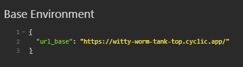

### 1. Listar categorias <a name="listar-categorias"></a>

Endpoint: `GET /categoria`

> Este endpoint permite que os usuários listem as categorias cadastradas.


[](#retornar-ao-índice)

---

## ✅Endpoints de Usuários
### 1. Cadastrar Usuário <a name="cadastrar-usuario"></a>

Endpoint: `POST /usuario`

> Este endpoint permite que os usuários registrem um novo usuário no sistema.

#### Corpo da requisição:

```JSON
{
  "nome": "Nome do Usuário",
  "email": "email@exemplo.com",
  "senha": "senha123"
}
```

#### Observação: todos os campos são obrigatórios.

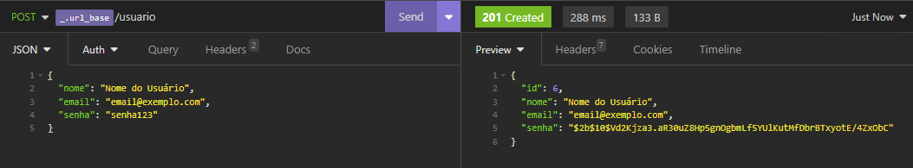

[](#retornar-ao-índice)

---

### 2. Efetuar Login do Usuário <a name="efetuar-login"></a>

Endpoint: `POST /login`

> Permite que um usuário cadastrado realize o login no sistema.

#### Corpo da requisição:

```JSON
{
  "email": "email@exemplo.com",
  "senha": "senha123"
}
```

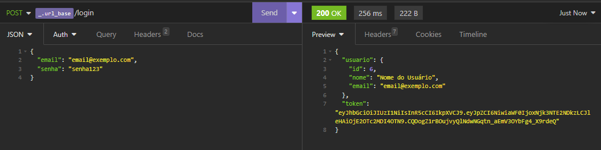

#### Observação: Após realizar o login com sucesso, um token será retornado. Esse token deve ser utilizado para autenticação nos próximos endpoints, pois eles são protegidos.

[](#retornar-ao-índice)

---

### 3. Detalhar Perfil do Usuário Logado <a name="detalhar-perfil-usuario"></a>

Endpoint: `GET /usuario`

> Este endpoint permite que um usuário visualize o seu perfil de forma detalhada.

#### Header:

- Authorization: Bearer SEU_TOKEN


[](#retornar-ao-índice)

---

### 4. Editar Perfil do Usuário Logado <a name="editar-perfil-usuario"></a>

Endpoint: `PUT /usuario`

> Este endpoint permite que um usuário logado atualize as informações do seu perfil.

#### Header:

Authorization: Bearer SEU_TOKEN

#### Corpo da requisição:

```JSON
{
  "nome": "Novo Nome",
  "email": "novo-email@exemplo.com",
  "senha": "novaSenha"
}
```

#### Observação: Todos os campos são obrigatórios.

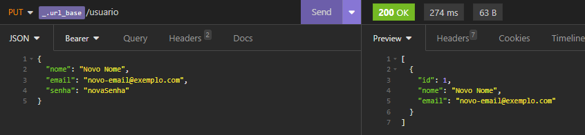

[](#retornar-ao-índice)

---

## ✅Endpoints de Produtos
### 1. Cadastrar Produto <a name="cadastrar-produto"></a>

Endpoint: `POST /produto`

> Essa é a rota que permite o usuário logado cadastrar um novo produto no sistema.

#### Header:

Authorization: Bearer SEU_TOKEN

#### Corpo da requisição:

```JSON
{
  "descricao": "Nome do Produto",
  "quantidade_estoque": 100,
  "valor": 5000,
  "categoria_id": 1
}
```

#### Observação: todos os campos são obrigatórios.

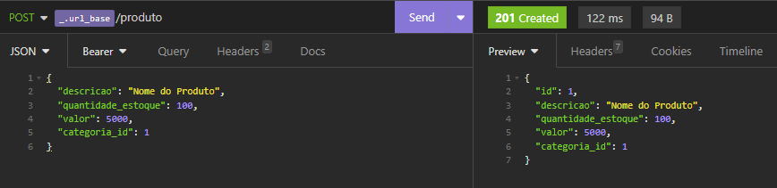

[](#retornar-ao-índice)

---

### 2. Editar Dados do Produto <a name="editar-dados-produto"></a>

Endpoint: `PUT /produto/:id`

> Essa é a rota que permite o usuário logado a atualizar as informações de um produto cadastrado.

#### Header:

Authorization: Bearer SEU_TOKEN

#### Corpo da requisição:

```JSON
{
  "descricao": "Nome do Produto",
	"quantidade_estoque": 150,
	"valor": 5500,
	"categoria_id": 8
}
```

#### Observação: todos os campos são obrigatórios.

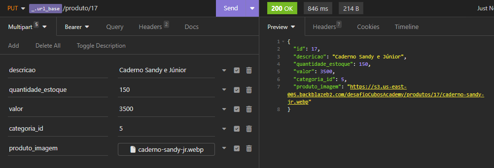

[](#retornar-ao-índice)

---

### 3. Listar Produtos <a name="listar-produtos"></a>

Endpoint: `GET /produto`

> Essa é a rota que será chamada quando o usuário logado quiser listar todos os produtos cadastrados.

#### Header:

Authorization: Bearer SEU_TOKEN

#### Requisição:

- Caso seja enviado o parâmetro do tipo query **categoria_id**, filtrar os produtos de acordo com a categoria, caso o id de categoria informada exista.

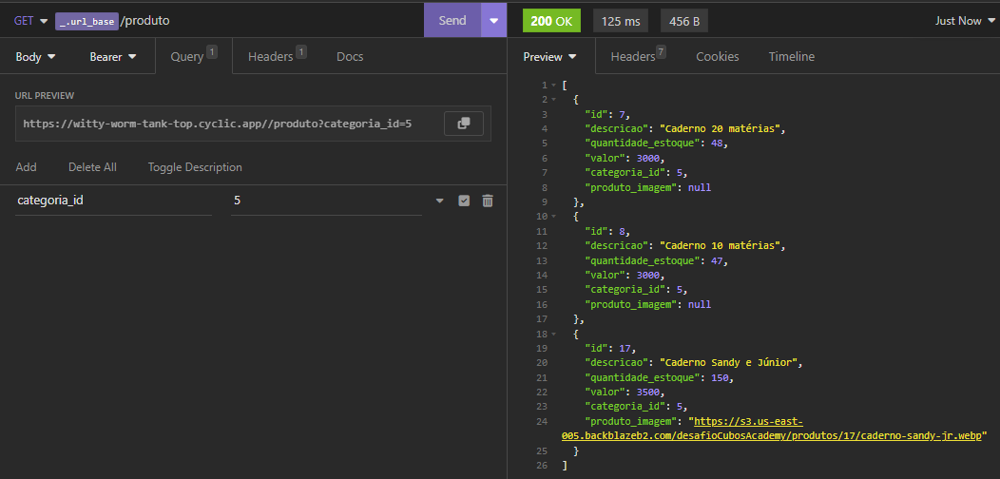

- Caso não seja informado o parâmetro do tipo query **categoria_id** todos os produtos cadastrados deverão ser retornados.

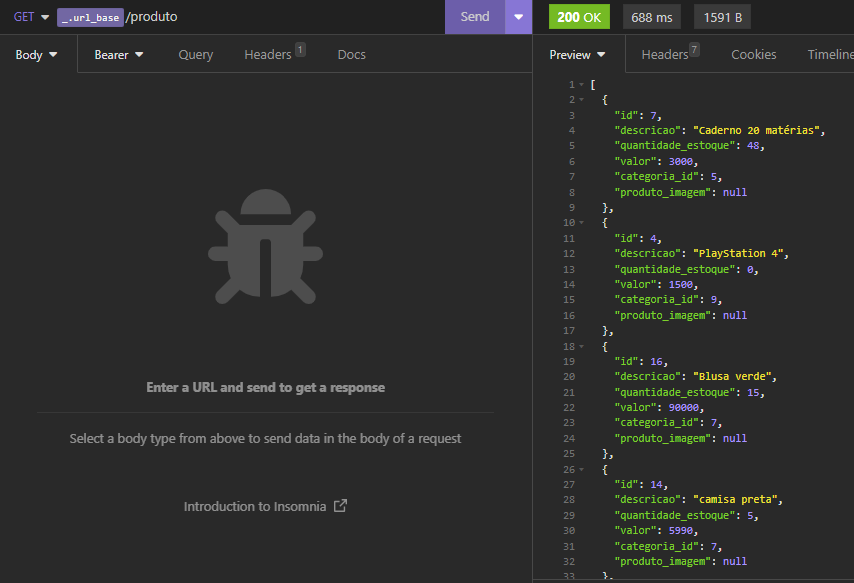

[](#retornar-ao-índice)

---

### 4. Detalhar Produto <a name="detalhar-produto"></a>

Endpoint: `GET /produto/:id`

> Essa é a rota que permite o usuário logado obter um de seus produtos cadastrados.

#### Header:

Authorization: Bearer SEU_TOKEN

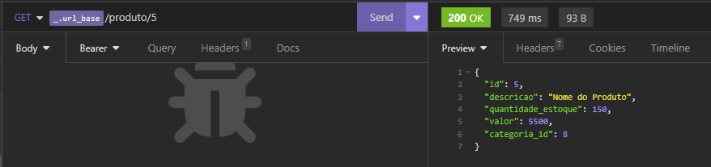

[](#retornar-ao-índice)

---

### 5. Excluir Produto por ID <a name="excluir-produto-por-id"></a>

Endpoint: `DELETE /produto/:id`

> Essa é a rota que será chamada quando o usuário logado quiser excluir um de seus produtos cadastrados.

#### Header:

Authorization: Bearer SEU_TOKEN

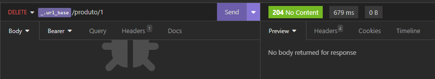

[](#retornar-ao-índice)

---

## ✅Endpoints de Clientes
### 1. Cadastrar Cliente <a name="cadastrar-cliente"></a>

Endpoint: `POST /cliente`

> Essa é a rota que permite usuário logado cadastrar um novo cliente no sistema.

#### Header:

Authorization: Bearer SEU_TOKEN

#### Corpo da requisição:

```JSON
{
  "nome": "Nome do Cliente",
  "email": "cliente@email.com",
  "cpf": "99999999999",
  "cep": "99999999",
  "rua": "Rua teste",
  "numero": "99",
  "bairro": "Teste",
  "cidade": "Teste",
  "estado": "Te"
}
```
OU

```JSON
{
  "nome": "Nome do Cliente",
  "email": "cliente@email.com",
  "cpf": "99999999999"
}
```

#### Observação: Os campos nome, email e cpf são obrigatórios.

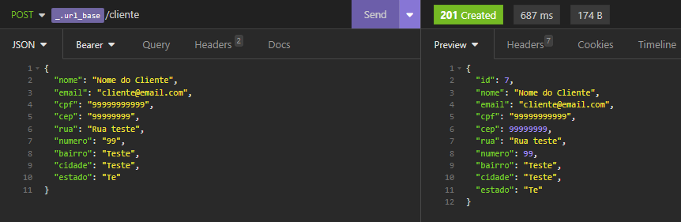

[](#retornar-ao-índice)

---

### 2. Editar dados do Cliente <a name="editar-dados-cliente"></a>

Endpoint: `PUT /cliente/:id`

> Essa é a rota que permite o usuário realizar atualização de um cliente cadastrado.

#### Header:

Authorization: Bearer SEU_TOKEN

#### Corpo da requisição:

```JSON
{
  "nome": "Nome do Cliente",
  "email": "cliente2@email.com",
  "cpf": "99999999990",
  "cep": "99999999",
  "rua": "Rua teste",
  "numero": "99",
  "bairro": "Teste",
  "cidade": "Teste",
  "estado": "Teste"
}
```
OU

```JSON
{
  "nome": "Nome do Cliente",
  "email": "cliente2@email.com",
  "cpf": "99999999990"
}
```

#### Observação: Os campos nome, email e cpf são obrigatórios.

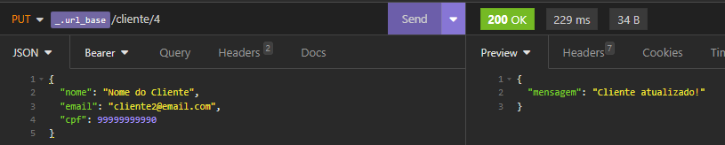

[](#retornar-ao-índice)

---

### 3. Listar Clientes <a name="listar-clientes"></a>

Endpoint: `GET /cliente`

> Essa é a rota que será chamada quando o usuário logado quiser listar todos os clientes cadastrados.

#### Header:

Authorization: Bearer SEU_TOKEN

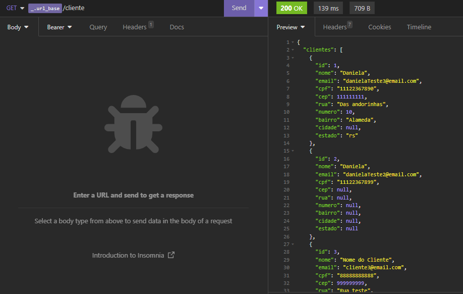

[](#retornar-ao-índice)

---

### 4. Detalhar Cliente <a name="detalhar-cliente"></a>

Endpoint: `GET /cliente/:id`

> Essa é a rota que será chamada quando o usuário logado quiser obter um de seus clientes cadastrados.

#### Header:

Authorization: Bearer SEU_TOKEN

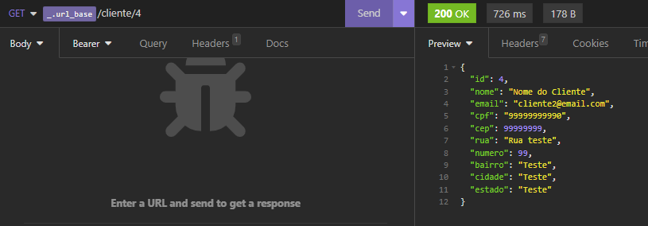

[](#retornar-ao-índice)

---

## 📌Tecnologias

#### As seguintes ferramentas foram usadas na construção do projeto:

#### **Server** ([NodeJS](https://nodejs.org/en/))

- **[Express](https://expressjs.com/)**
- **[CORS](https://expressjs.com/en/resources/middleware/cors.html)**
- **[bcrypt](https://www.npmjs.com/package/bcrypt)**
- **[jsonwebtoken](https://jwt.io/)**
- **[KnexJS](http://knexjs.org/)**
- **[dotENV](https://github.com/motdotla/dotenv)**

> Veja o arquivo [package.json](https://github.com/SaraBahck/desafio-backend-m05-b2bt05-equipe07/blob/main/package.json)

#### **Utilitários**

- Deploy: **[API](https://witty-worm-tank-top.cyclic.app/)**
- Editor: **[Visual Studio Code](https://code.visualstudio.com/)**
- Teste de API: **[Insomnia](https://insomnia.rest/)**

---

## Autoras

<table>
  <tr>
    <td align="center"><a href="https://github.com/Danifeares"><br /><sub><b>Daniela Felipe Soares</b></sub></a><br /><a href="https://github.com/Danifeares">👩‍💻</a></td>
	  <td align="center"><a href="https://github.com/GessycaBorges"><br /><sub><b>Gessyca Borges</b></sub></a><br /><a href="https://github.com/GessycaBorges">👩‍💻</a></td>
    <td align="center"><a href="https://github.com/mirellaor"><br /><sub><b>Mirella Rebouças</b></sub></a><br /><a href="https://github.com/mirellaor">👩‍💻</a></td>
    <td align="center"><a href="https://github.com/Nataliasalles1"><br /><sub><b>Natalia Salles</b></sub></a><br /><a href="https://github.com/Nataliasalles1">👩‍💻</a></td>
    <td align="center"><a href="https://github.com/SaraBahck"><br /><sub><b>Sara Webery</b></sub></a><br /><a href="https://github.com/SaraBahck">👩‍💻</a></td> 
    
  </tr>
</table>
